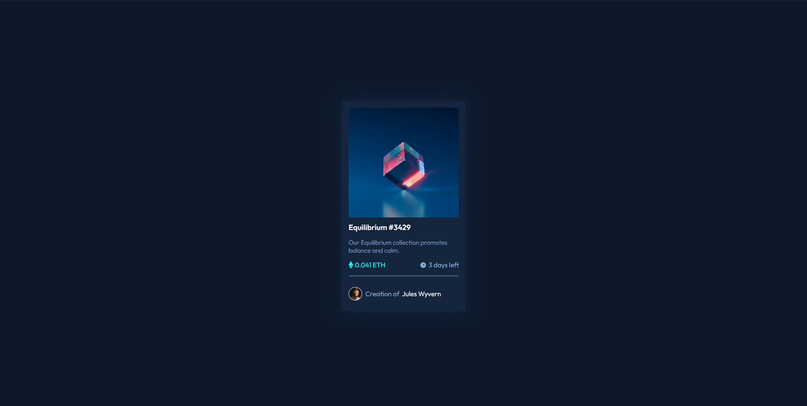

# Frontend Mentor - NFT preview card component solution

This is a solution to the [NFT preview card component challenge on Frontend Mentor](https://www.frontendmentor.io/challenges/nft-preview-card-component-SbdUL_w0U). Frontend Mentor challenges help you improve your coding skills by building realistic projects. 

## Table of contents

- [Overview](#overview)
  - [The challenge](#the-challenge)
  - [Screenshot](#screenshot)
  - [Links](#links)
- [My process](#my-process)
  - [Built with](#built-with)
  - [What I learned](#what-i-learned)
- [Author](#author)

## Overview

### The challenge

Users should be able to:

- View the optimal layout depending on their device's screen size
- See hover states for interactive elements

### Screenshot



### Links

- Solution URL: [Github](https://github.com/GrzywN/nft-preview-card-component-main)
- Live Site URL: [Repl.it](https://your-live-site-url.com)

## My process

### Built with

- Semantic HTML5 markup
- CSS custom properties
- Flexbox
- Mobile-first workflow
- SASS/SCSS preprocessor
- Workflow shared between different SCSS files

### What I learned

I had trouble using opacity properties for hover nft divs, but hsla() function came in handy and I was able to make semi-transparent background and not transparent eye (view) icon. Sometimes it's more worth it to use opacity built in hsla and rgba than opacity CSS property.

```css
.proud-of-this-css {
  background-color: hsla(255,255,255,0.5)
}
```

## Author

- GitHub - [GrzywN (Karol Binkowski) · GitHub](https://github.com/GrzywN)
- Frontend Mentor - [@GrzywN](https://www.frontendmentor.io/profile/GrzywN)
- Discord - fansik#2808
